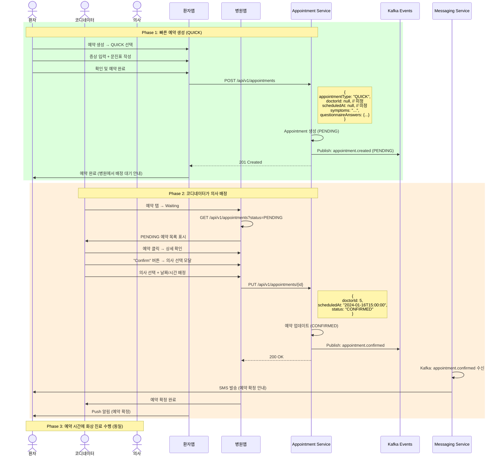
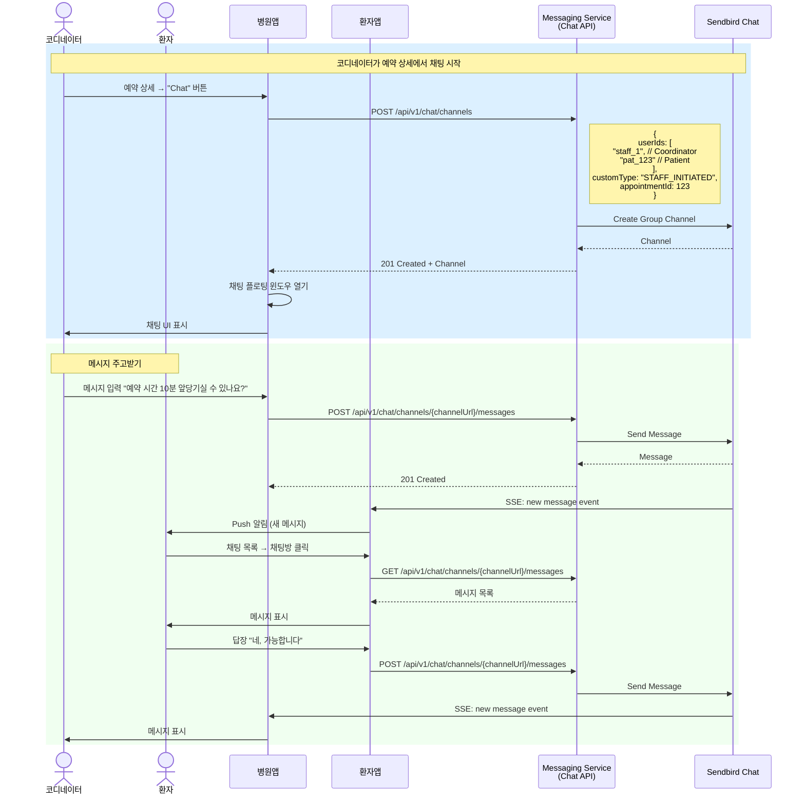
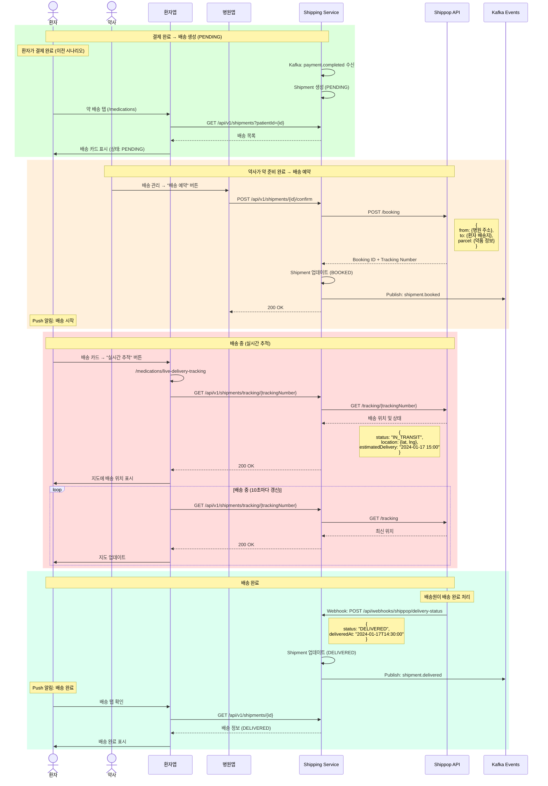
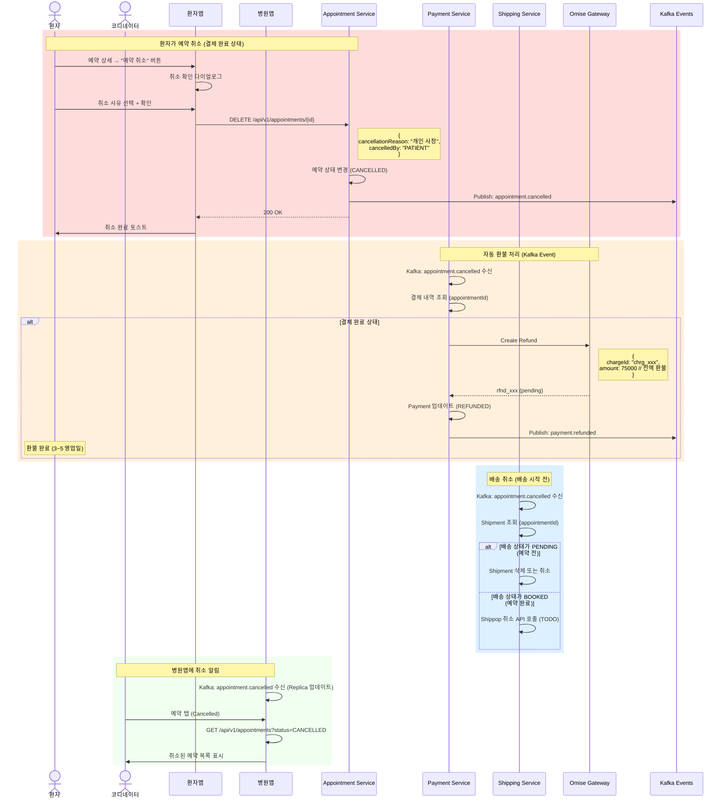

```mermaid
sequenceDiagram
    actor Patient as 환자
    actor Coordinator as 코디네이터
    actor Doctor as 의사
    
    participant PatientApp as 환자앱
    participant HospitalApp as 병원앱
    
    participant PatientService as Patient Service<br/>(18081)
    participant HospitalService as Hospital Service<br/>(18082)
    participant AppointmentService as Appointment Service<br/>(18083)
    participant MessagingService as Messaging Service<br/>(18084)
    participant PaymentService as Payment Service<br/>(18085)
    participant StorageService as Storage Service<br/>(18087)
    participant TranslationService as Translation Service<br/>(18088)
    participant VideoCallService as Video Call Service<br/>(18089)
    participant ShippingService as Shipping Service<br/>(18090)
    
    participant Kafka as Kafka Events
    participant Sendbird as Sendbird
    participant Omise as Omise Gateway
    participant Shippop as Shippop API

    %% ===== Phase 1: 회원가입 =====
    rect rgb(200, 230, 255)
        Note over Patient,PatientService: Phase 1: 회원가입 및 프로필 등록
        
        Patient->>PatientApp: 전화번호 입력 (+66-xxx-xxxx)
        PatientApp->>PatientService: POST /api/auth/otp/send
        PatientService->>MessagingService: SMS 발송 요청
        MessagingService->>Patient: SMS (OTP 코드)
        
        Patient->>PatientApp: OTP 코드 입력
        PatientApp->>PatientService: POST /api/auth/otp/verify
        PatientService-->>PatientApp: 200 OK + tempJwt
        
        PatientApp->>PatientService: GET /api/auth/profile (404 = 신규)
        
        Patient->>PatientApp: 프로필 정보 입력
        PatientApp->>PatientService: POST /api/auth/profile/complete
        PatientService->>Kafka: Publish: patient.created
        PatientService-->>PatientApp: 200 OK + Cookies (sid, ctx)
        
        PatientApp->>Patient: 회원가입 완료 → 예약 목록 (/appointments)
    end

    %% ===== Phase 2: 예약 생성 =====
    rect rgb(220, 255, 220)
        Note over Patient,AppointmentService: Phase 2: 일반 예약 생성 (STANDARD)
        
        Patient->>PatientApp: 예약 생성 버튼 → STANDARD 선택
        
        %% Step 1: 의사 선택
        PatientApp->>HospitalService: GET /api/v1/hospitals/{id}/doctors
        HospitalService-->>PatientApp: 의사 목록
        Patient->>PatientApp: 의사 선택 + 날짜/시간 선택
        
        %% Step 2: 증상 입력 + 사진 업로드
        Patient->>PatientApp: 증상 입력 + 사진 업로드
        PatientApp->>StorageService: POST /api/v1/storage/upload
        StorageService-->>PatientApp: 200 OK + imageUrl (S3)
        
        %% Step 3: 문진표 작성
        Patient->>PatientApp: 문진표 작성 (알레르기, 복용약 등)
        
        %% Step 4: 예약 생성
        Patient->>PatientApp: 확인 및 예약 완료
        PatientApp->>AppointmentService: POST /api/v1/appointments
        Note right of AppointmentService: {<br/>  appointmentType: "STANDARD",<br/>  doctorId: "doc_123",<br/>  scheduledAt: "2024-01-16T14:00:00",<br/>  symptoms: "...",<br/>  questionnaireAnswers: {...}<br/>}
        
        AppointmentService->>AppointmentService: Appointment 생성 (CONFIRMED)
        AppointmentService->>Kafka: Publish: appointment.created
        AppointmentService-->>PatientApp: 201 Created
        
        %% CDC Sync to Hospital Service
        Kafka->>HospitalService: Kafka Consumer: AppointmentReplica 생성
        
        PatientApp->>Patient: 예약 완료 → 예약 목록
    end

    %% ===== Phase 3: 병원앱에서 예약 확인 =====
    rect rgb(255, 240, 220)
        Note over Coordinator,HospitalService: Phase 3: 병원앱에서 예약 확인
        
        Coordinator->>HospitalApp: 예약 탭 → Confirmed
        HospitalApp->>HospitalService: GET /api/v1/appointments?status=CONFIRMED
        HospitalService-->>HospitalApp: 예약 목록 (Replica)
        
        Coordinator->>HospitalApp: 예약 상세 확인
        HospitalApp->>HospitalService: GET /api/v1/appointments/{sequence}
        HospitalService-->>HospitalApp: 예약 상세
        
        HospitalApp->>Coordinator: 환자 증상, 문진표 확인
    end

    %% ===== Phase 4: 화상 진료 =====
    rect rgb(255, 220, 220)
        Note over Patient,Doctor: Phase 4: 화상 진료 (예약 시간 도래)
        
        %% 의사가 먼저 입장
        Doctor->>HospitalApp: 예약 상세 → "진료 시작" 버튼
        HospitalApp->>VideoCallService: POST /api/v1/video-calls
        VideoCallService->>Sendbird: Create Room
        Sendbird-->>VideoCallService: Room ID
        VideoCallService-->>HospitalApp: 201 Created + Session
        
        HospitalApp->>VideoCallService: POST /api/v1/video-calls/{sessionId}/join (DOCTOR)
        VideoCallService->>Sendbird: Generate Access Token
        Sendbird-->>VideoCallService: Access Token
        VideoCallService-->>HospitalApp: 200 OK
        
        HospitalApp->>Sendbird: authenticate + room.enter()
        HospitalApp->>Doctor: 진료실 대기 (환자 입장 대기)
        
        %% 환자 입장
        Patient->>PatientApp: 예약 상세 → "진료 시작" 버튼
        PatientApp->>VideoCallService: GET /api/v1/video-calls/appointment/{id}
        VideoCallService-->>PatientApp: 200 OK + Session
        
        PatientApp->>VideoCallService: POST /api/v1/video-calls/{sessionId}/join (PATIENT)
        VideoCallService-->>PatientApp: 200 OK + Access Token
        
        PatientApp->>Sendbird: authenticate + room.enter()
        Sendbird->>HospitalApp: onRemoteParticipantEntered
        Sendbird->>PatientApp: onRemoteParticipantEntered
        
        HospitalApp->>Doctor: 환자 비디오 표시
        PatientApp->>Patient: 의사 비디오 표시
        
        %% 실시간 번역
        PatientApp->>TranslationService: POST /api/v1/translations/sessions
        TranslationService-->>PatientApp: WebSocket URL
        PatientApp->>TranslationService: WebSocket 연결
        
        Note over Patient,Doctor: 화상 진료 진행 (대화, 진찰, 번역)
        
        TranslationService->>PatientApp: 실시간 자막 (태국어 → 한국어)
    end

    %% ===== Phase 5: 진료 기록 및 처방전 발급 =====
    rect rgb(240, 220, 255)
        Note over Doctor,AppointmentService: Phase 5: 진료 기록 작성 및 처방전 발급
        
        Doctor->>HospitalApp: 진료 종료 버튼
        HospitalApp->>HospitalApp: 진료 기록 입력 모달
        Doctor->>HospitalApp: 진료 기록 + 처방전 입력
        Note over Doctor: - 진단명: 감기<br/>- 처방: 타이레놀 500mg<br/>- 복용: 3일, 1일 3회<br/>- 배송 필요: Yes
        
        HospitalApp->>AppointmentService: PUT /api/v1/appointments/{id}/complete
        Note right of AppointmentService: {<br/>  status: "COMPLETED",<br/>  diagnosis: "감기",<br/>  prescription: {<br/>    medications: [...],<br/>    requiresDelivery: true<br/>  },<br/>  medicalNotes: "..."<br/>}
        
        AppointmentService->>AppointmentService: 예약 상태 변경 (COMPLETED)
        AppointmentService->>Kafka: Publish: appointment.completed (with prescription)
        AppointmentService-->>HospitalApp: 200 OK
        
        %% 화상 통화 종료
        HospitalApp->>Sendbird: room.exit()
        PatientApp->>Sendbird: room.exit()
        HospitalApp->>VideoCallService: POST /api/v1/video-calls/{sessionId}/end
        VideoCallService-->>HospitalApp: 200 OK
        
        PatientApp->>TranslationService: DELETE /api/v1/translations/sessions/{id}
        
        HospitalApp->>Doctor: 진료 완료 → Completed 탭
        PatientApp->>Patient: 진료 완료 → 결제 페이지 안내
    end

    %% ===== Phase 6: 결제 (진료비 + 약값 + 배송비) =====
    rect rgb(220, 255, 240)
        Note over Patient,ShippingService: Phase 6: 결제 (처방전 포함)
        
        Patient->>PatientApp: 예약 상세 → "결제" 버튼
        PatientApp->>PatientApp: /appointments/{id}/payment-with-prescription
        
        %% 배송지 선택
        PatientApp->>PatientService: GET /api/v1/delivery-addresses?patientId={id}
        PatientService-->>PatientApp: 배송지 목록
        Patient->>PatientApp: 배송지 선택 (또는 신규 추가)
        
        %% 배송비 견적
        PatientApp->>ShippingService: POST /api/v1/shipments/quote
        Note right of ShippingService: {<br/>  appointmentId: 123,<br/>  deliveryAddressId: "addr_abc",<br/>  parcelValue: 200.00<br/>}
        
        ShippingService->>Shippop: POST /price_list
        Shippop-->>ShippingService: 배송비 견적 (50 THB)
        ShippingService-->>PatientApp: 200 OK + Quote
        
        PatientApp->>Patient: 총 금액 표시<br/>(진료비 500 + 약값 200 + 배송비 50 = 750 THB)
        
        %% 결제
        Patient->>PatientApp: 결제하기 (카드 정보 입력)
        PatientApp->>Omise: Omise.createToken(card)
        Omise-->>PatientApp: tokn_xxx
        
        PatientApp->>PaymentService: POST /api/v1/payments/charge
        Note right of PaymentService: {<br/>  appointmentId: 123,<br/>  amount: 750.00,<br/>  currency: "THB",<br/>  paymentMethod: "card",<br/>  omiseToken: "tokn_xxx",<br/>  deliveryAddressId: "addr_abc"<br/>}
        
        PaymentService->>PaymentService: Payment 생성 (PENDING)
        PaymentService->>Omise: Create Charge (75000 satang)
        Omise-->>PaymentService: chrg_xxx (successful)
        
        PaymentService->>PaymentService: Payment 업데이트 (SUCCESS)
        PaymentService->>Kafka: Publish: payment.completed
        PaymentService-->>PatientApp: 200 OK
        
        PatientApp->>Patient: 결제 완료 → /appointments/payment/complete
    end

    %% ===== Phase 7: 배송 생성 및 추적 =====
    rect rgb(255, 255, 220)
        Note over Patient,ShippingService: Phase 7: 약 배송 생성 및 추적
        
        %% Kafka Event Listener
        ShippingService->>ShippingService: Kafka: payment.completed 수신
        ShippingService->>ShippingService: Shipment 생성 (PENDING)
        
        %% 병원 약사가 약 준비 완료 후 배송 예약
        Note over Coordinator: 약사가 약 준비 완료
        Coordinator->>HospitalApp: 배송 예약 버튼
        HospitalApp->>ShippingService: POST /api/v1/shipments/{id}/confirm
        
        ShippingService->>Shippop: POST /booking
        Note right of Shippop: {<br/>  from: {...},  // 병원<br/>  to: {...},    // 환자<br/>  parcel: {...}<br/>}
        Shippop-->>ShippingService: Booking ID + Tracking Number
        
        ShippingService->>ShippingService: Shipment 업데이트 (BOOKED)
        ShippingService->>Kafka: Publish: shipment.booked
        ShippingService-->>HospitalApp: 200 OK
        
        %% 환자가 배송 추적
        Patient->>PatientApp: 약 배송 탭 → 배송 카드 클릭
        PatientApp->>PatientApp: /medications/{id}
        PatientApp->>ShippingService: GET /api/v1/shipments/{id}
        ShippingService-->>PatientApp: 배송 정보 (tracking number)
        
        Patient->>PatientApp: 실시간 추적 버튼
        PatientApp->>ShippingService: GET /api/v1/shipments/tracking/{trackingNumber}
        ShippingService->>Shippop: GET /tracking/{trackingNumber}
        Shippop-->>ShippingService: 배송 위치 및 상태
        ShippingService-->>PatientApp: 200 OK
        
        PatientApp->>Patient: 지도에 배송 위치 표시
        
        Note over Patient: 배송 완료 (1~2일 후)
        Shippop->>ShippingService: Webhook: delivery.completed
        ShippingService->>ShippingService: Shipment 업데이트 (DELIVERED)
        ShippingService->>Kafka: Publish: shipment.delivered
    end
```

# 전체 통합 프로세스 플로우 (End-to-End Flow)

## 🌍 DrCall Global - 비대면 진료 서비스

환자앱과 병원앱이 함께 동작하는 전체 프로세스를 시나리오별로 정리합니다.

---

## 📋 전체 시나리오 목록

1. **신규 환자 회원가입 → 예약 → 진료 → 결제 → 배송 (Full Journey)**
2. **기존 환자 로그인 → 빠른 예약 → 코디네이터 배정 → 진료 → 결제**
3. **환자-병원 채팅 플로우**
4. **약 배송 추적 플로우**
5. **예약 취소 및 환불 플로우**

---

## 🎯 시나리오 1: Full Journey (신규 환자)

### 개요
신규 환자가 회원가입부터 진료, 결제, 약 배송까지 전체 과정을 경험하는 가장 일반적인 플로우

### 플로우 단계
1. 환자 회원가입 (OTP 인증)
2. 프로필 등록
3. 일반 예약 생성 (STANDARD)
4. 화상 진료 수행
5. 처방전 발급
6. 결제 (진료비 + 약값 + 배송비)
7. 약 배송 추적

---

### 시퀀스 다이어그램



---

## 🚀 시나리오 2: 빠른 예약 (QUICK) + 코디네이터 배정

### 개요
환자가 빠른 예약을 생성하고, 코디네이터가 의사를 배정하는 플로우

### 플로우 단계
1. 환자가 QUICK 예약 생성 (의사, 시간 미정)
2. 예약 상태: PENDING
3. 코디네이터가 예약 확인 및 의사 배정
4. 예약 상태: CONFIRMED
5. 진료 수행 (동일)

---

### 시퀀스 다이어그램



---

## 💬 시나리오 3: 환자-병원 채팅 플로우

### 개요
환자가 예약 관련 문의를 위해 병원과 채팅하는 플로우

### 시나리오 케이스
1. **환자가 먼저 채팅 시작** (예약 전 문의)
2. **코디네이터가 먼저 채팅 시작** (예약 후 추가 정보 요청)

---

### 시퀀스 다이어그램 - 코디네이터가 먼저 시작



---

## 📦 시나리오 4: 약 배송 추적 플로우

### 개요
환자가 결제 완료 후 약 배송 상태를 실시간으로 추적하는 플로우

### 배송 상태 전환
```
PENDING (결제 완료) → BOOKED (배송 예약) → IN_TRANSIT (배송 중) → DELIVERED (배송 완료)
```

---

### 시퀀스 다이어그램



---

## 🔄 시나리오 5: 예약 취소 및 환불 플로우

### 개요
환자 또는 병원이 예약을 취소하고, 결제가 완료된 경우 환불 처리하는 플로우

### 취소 케이스
1. **환자가 취소** (환자앱에서)
2. **병원이 취소** (병원앱에서)
3. **결제 전 취소** (환불 불필요)
4. **결제 후 취소** (환불 필요)

---

### 시퀀스 다이어그램 - 환자가 결제 후 취소 (환불 포함)



---

## 🌐 전체 시스템 아키텍처

### MSA 서비스 구성

```
┌─────────────────────────────────────────────────────────────────┐
│                        Frontend Layer                           │
├─────────────────────────────────────────────────────────────────┤
│  Patient App (환자앱)           │  Hospital App (병원앱)        │
│  - React + TypeScript           │  - React + TypeScript         │
│  - Vite                         │  - Vite                       │
│  - Sendbird SDK                 │  - Sendbird SDK               │
│  - Omise.js                     │                               │
└────────────┬───────────────────────┬────────────────────────────┘
             │                       │
             └───────────┬───────────┘
                         │
┌────────────────────────┴───────────────────────────────────────┐
│                     API Gateway (TODO)                         │
│                   (Optional: Kong, AWS ALB)                    │
└────────────┬───────────────────────────────────────────────────┘
             │
┌────────────┴───────────────────────────────────────────────────┐
│                     Backend Services (MSA)                     │
├────────────────────────────────────────────────────────────────┤
│                                                                │
│  ┌──────────────────┐  ┌──────────────────┐                  │
│  │ Patient Service  │  │ Hospital Service │                  │
│  │   (18081)        │  │   (18082)        │                  │
│  │  - Patient CRUD  │  │  - Staff Auth    │                  │
│  │  - OTP Auth      │  │  - Doctor Mgmt   │                  │
│  │  - PHR           │  │  - CDC Replicas  │                  │
│  │  - Delivery Addr │  │                  │                  │
│  └────────┬─────────┘  └────────┬─────────┘                  │
│           │                     │                             │
│  ┌────────┴─────────────────────┴─────────┐                  │
│  │      Appointment Service (18083)       │                  │
│  │       - Appointment CRUD               │                  │
│  │       - Status Management              │                  │
│  │       - Kafka Events                   │                  │
│  └────────┬───────────────────────────────┘                  │
│           │                                                   │
│  ┌────────┴─────────┐  ┌──────────────────┐                  │
│  │ Payment Service  │  │ Shipping Service │                  │
│  │   (18085)        │  │   (18090)        │                  │
│  │  - Omise Gateway │  │  - Shippop API   │                  │
│  │  - Charge/Refund │  │  - Tracking      │                  │
│  └──────────────────┘  └──────────────────┘                  │
│                                                               │
│  ┌──────────────────┐  ┌──────────────────┐                  │
│  │ Video Call Svc   │  │ Translation Svc  │                  │
│  │   (18089)        │  │   (18088)        │                  │
│  │  - Sendbird SFU  │  │  - STT + MT      │                  │
│  │  - Session Mgmt  │  │  - WebSocket     │                  │
│  └──────────────────┘  └──────────────────┘                  │
│                                                               │
│  ┌──────────────────┐  ┌──────────────────┐                  │
│  │ Messaging Svc    │  │ Storage Service  │                  │
│  │   (18084)        │  │   (18087)        │                  │
│  │  - Sendbird Chat │  │  - AWS S3        │                  │
│  │  - SMS (Infobank)│  │  - File Upload   │                  │
│  │  - SSE           │  │                  │                  │
│  └──────────────────┘  └──────────────────┘                  │
│                                                               │
│  ┌──────────────────────────────────────────┐                │
│  │      Admin Service (18086)               │                │
│  │       - System Management                │                │
│  └──────────────────────────────────────────┘                │
│                                                               │
└────────────┬──────────────────────────────────────────────────┘
             │
┌────────────┴───────────────────────────────────────────────────┐
│                     Event Bus (Kafka)                          │
│  Topics: appointment.*, payment.*, shipment.*, patient.*      │
└────────────┬───────────────────────────────────────────────────┘
             │
┌────────────┴───────────────────────────────────────────────────┐
│                    External Services                           │
├────────────────────────────────────────────────────────────────┤
│  - Sendbird (Chat, Video)                                     │
│  - Omise (Payment Gateway - Thailand)                         │
│  - Shippop (Shipping - Thailand)                              │
│  - Infobank (SMS - Thailand)                                  │
│  - AWS S3 (File Storage)                                      │
│  - OpenAI (Translation - TODO)                                │
└────────────────────────────────────────────────────────────────┘
```

---

## 📊 Kafka Event Topics

### 이벤트 기반 통신

| Topic | Producer | Consumer | Event Types |
|-------|----------|----------|-------------|
| `appointment-events` | Appointment Service | Hospital Service (CDC), Payment Service, Shipping Service, Messaging Service | appointment.created<br/>appointment.confirmed<br/>appointment.started<br/>appointment.completed<br/>appointment.cancelled |
| `payment-events` | Payment Service | Appointment Service, Shipping Service | payment.completed<br/>payment.failed<br/>payment.refunded |
| `shipment-events` | Shipping Service | Patient Service, Messaging Service | shipment.created<br/>shipment.booked<br/>shipment.in_transit<br/>shipment.delivered |
| `patient-events` | Patient Service | Hospital Service (CDC) | patient.created<br/>patient.updated |
| `notification-events` | Messaging Service | - | notification.sent<br/>notification.failed |

---

## ✅ 다음 단계
- 백엔드 API 명세 및 누락 API 분석
- MSA 서비스별 API 엔드포인트 상세 목록
- 데이터 모델 및 타입 정의 문서
- 배포 체크리스트 및 테스트 시나리오

