# 병원앱 (Hospital App) - 유저 플로우 및 시퀀스

## 🏥 병원앱 개요

병원 직원(코디네이터, 의사)이 환자 예약 및 진료를 관리하는 웹 애플리케이션

**주요 사용자**:
- **코디네이터**: 예약 관리, 환자 등록, 의사 배정
- **의사**: 진료 수행, 처방전 발급, 진료 기록 작성

**주요 기능**:
- 로그인 (ID/PW 기반)
- 대시보드 (일일 통계)
- 예약 관리 (Pending → Confirmed → In Progress → Completed)
- 환자 관리 (등록, 조회, 수정)
- 의사 관리 (등록, 스케줄 관리)
- 화상 진료 (Sendbird Video Call)
- 채팅 (환자와 1:1 채팅)
- 결제 내역 조회
- 진료 기록 작성
- 다국어 지원 (한국어, 영어, 태국어)

---

## 🔐 1. 로그인 플로우

### 1.1 사용자 시나리오

#### 병원 직원 로그인
1. 아이디/비밀번호 입력
2. 로그인 API 호출
3. Access Token 발급
4. 대시보드로 이동

**인증 전략**:
- JWT 기반 (Access Token)
- localStorage에 저장
- 유효기간: 24시간
- 자동 로그인 (Remember Me)

---

### 1.2 시퀀스 다이어그램

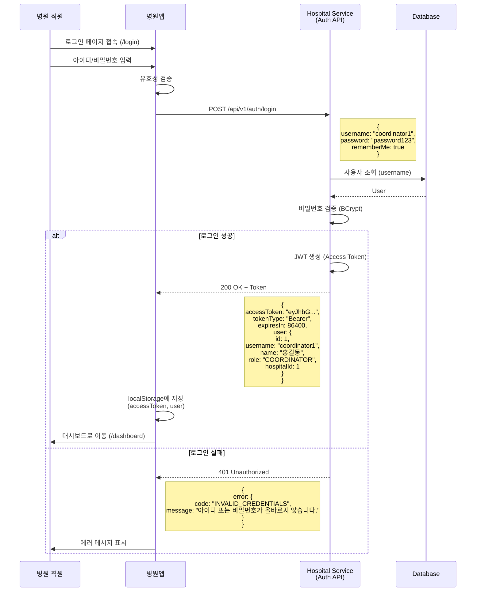

---

### 1.3 API 명세 - 로그인

```
POST /api/v1/auth/login
Content-Type: application/json

Request:
{
  "username": "coordinator1",
  "password": "password123",
  "rememberMe": true
}

Response (200 OK):
{
  "success": true,
  "data": {
    "accessToken": "eyJhbGciOiJIUzI1NiIsInR5cCI6IkpXVCJ9...",
    "tokenType": "Bearer",
    "expiresIn": 86400,
    "user": {
      "id": 1,
      "username": "coordinator1",
      "name": "홍길동",
      "role": "COORDINATOR",
      "hospitalId": 1,
      "hospitalName": "Global Medical Center"
    }
  }
}

Response (401 Unauthorized):
{
  "success": false,
  "error": {
    "code": "INVALID_CREDENTIALS",
    "message": "아이디 또는 비밀번호가 올바르지 않습니다."
  }
}
```

---

## 📊 2. 대시보드

### 2.1 사용자 시나리오
- 오늘의 예약 통계 (대기/확정/완료/취소)
- 최근 예약 목록 (빠른 접근)
- 금일 진료 완료 건수
- 금일 매출

### 2.2 시퀀스 다이어그램

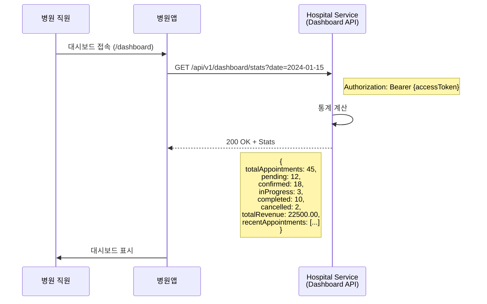

---

## 📅 3. 예약 관리 플로우

### 3.1 예약 상태 전환

```
PENDING (대기) → CONFIRMED (확정) → IN_PROGRESS (진행 중) → COMPLETED (완료)
                                ↓
                            CANCELLED (취소)
```

### 3.2 코디네이터 역할

#### PENDING 예약 처리 (QUICK 예약)
1. 예약 목록 조회 (Waiting 탭)
2. 예약 상세 확인 (증상, 문진표)
3. 의사 배정
4. 날짜/시간 배정
5. 예약 확정 (PENDING → CONFIRMED)

#### CONFIRMED 예약 관리
1. 예약 목록 조회 (Confirmed 탭)
2. 예약 상세 확인
3. 환자와 채팅 (필요 시)
4. 예약 수정 (날짜/시간/의사 변경)
5. 예약 취소 (Cancellation Reason 입력)

---

### 3.3 시퀀스 다이어그램 - PENDING 예약 확정

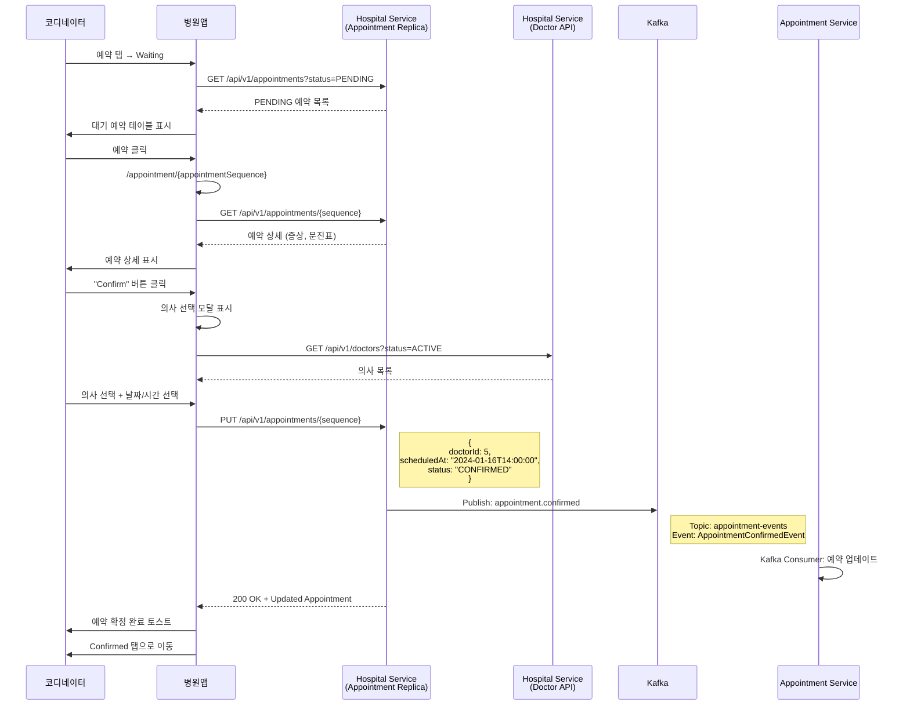

---

### 3.4 시퀀스 다이어그램 - 예약 취소

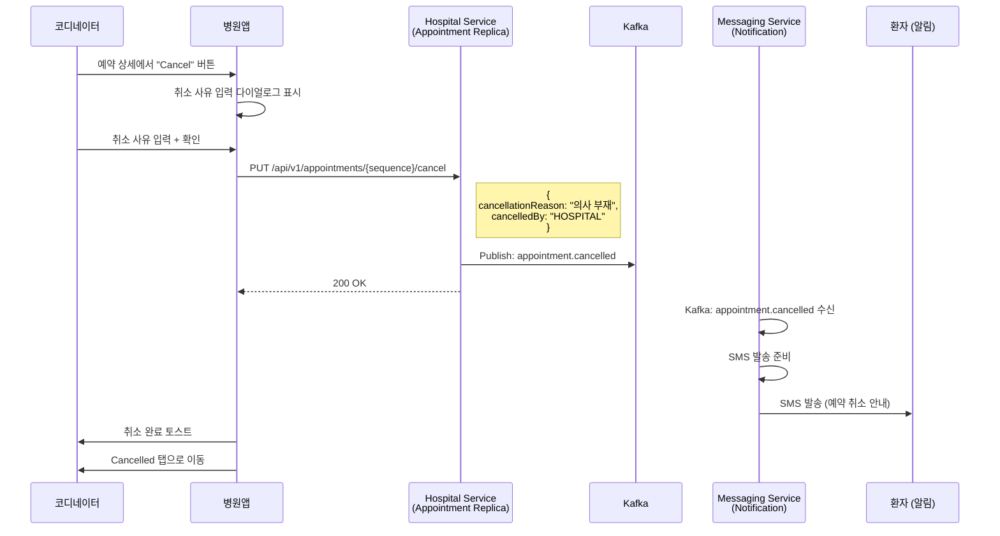

---

### 3.5 시퀀스 다이어그램 - 환자와 채팅

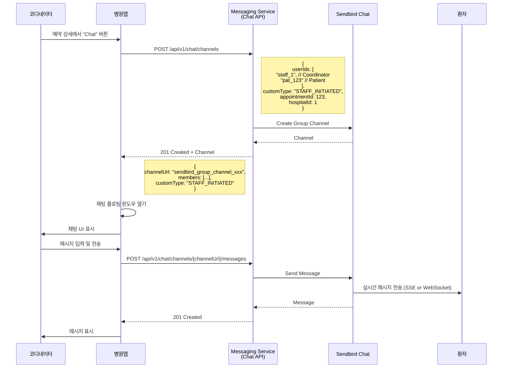

---

## 👥 4. 환자 관리 플로우

### 4.1 코디네이터 역할
- 환자 등록 (Walk-in 환자)
- 환자 조회 (검색: 이름, 전화번호, Thai ID)
- 환자 상세 조회 (기본 정보, 건강 정보, 예약 기록, 진료 기록)
- 환자 정보 수정

---

### 4.2 시퀀스 다이어그램 - 환자 등록

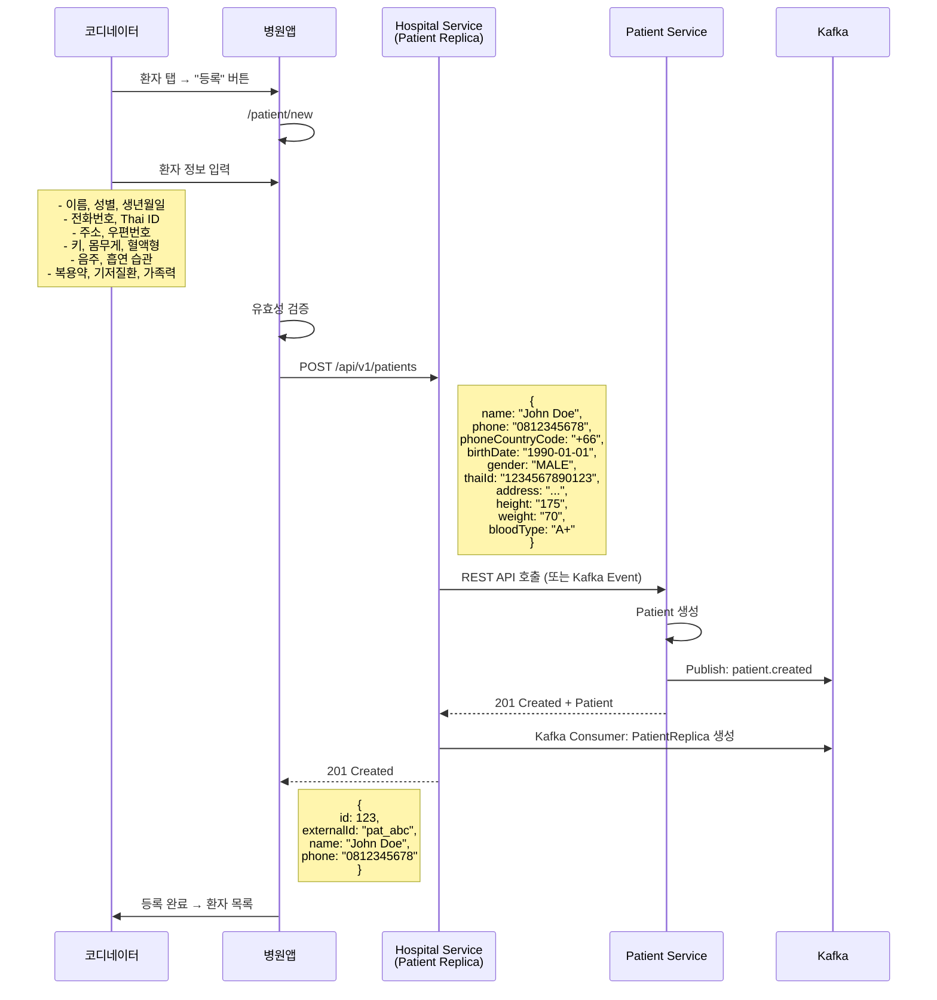

---

### 4.3 시퀀스 다이어그램 - 환자 조회 및 상세

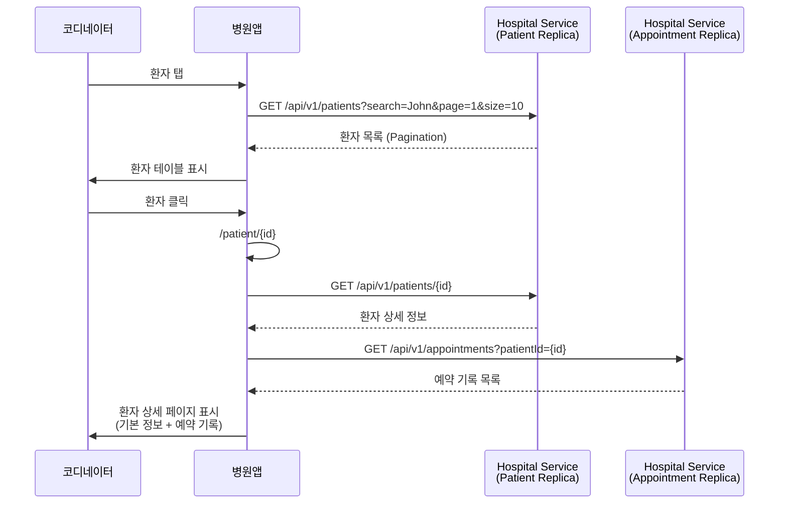

---

## 👨‍⚕️ 5. 의사 관리 플로우

### 5.1 코디네이터 역할
- 의사 등록
- 의사 조회
- 의사 스케줄 관리 (근무 시간, 휴무일)
- 의사 계정 활성화/비활성화

---

### 5.2 시퀀스 다이어그램 - 의사 등록

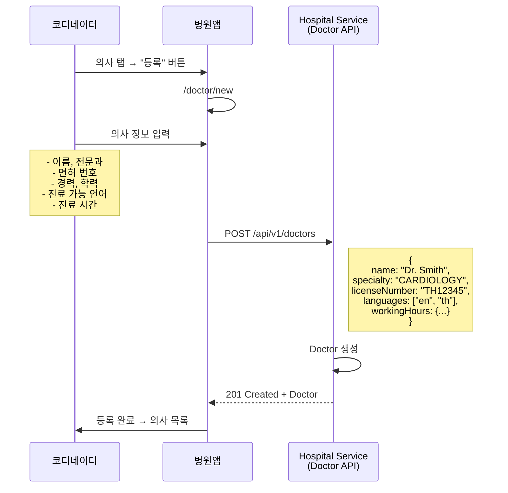

---

## 🎥 6. 화상 진료 플로우 (의사)

### 6.1 의사 역할
- 예약 시간에 진료실 입장
- 환자와 화상 통화
- 실시간 번역 (필요 시)
- 진료 기록 작성
- 처방전 발급
- 진료 종료

---

### 6.2 시퀀스 다이어그램 - 진료 시작 및 완료

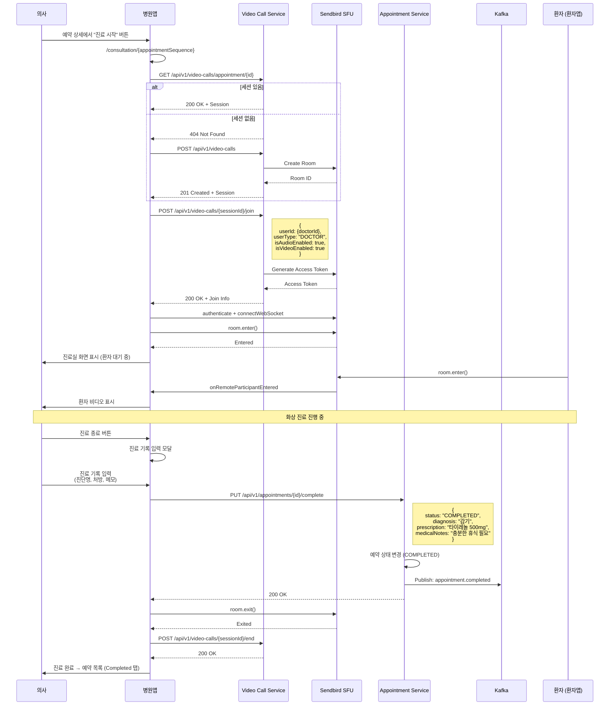

---

## 💊 7. 처방전 발급 및 약 배송

### 7.1 의사 역할
- 진료 완료 시 처방전 발급 여부 선택
- 처방전 발급 시 약 정보 입력
- 배송 필요 여부 선택

### 7.2 시퀀스 다이어그램 - 처방전 발급

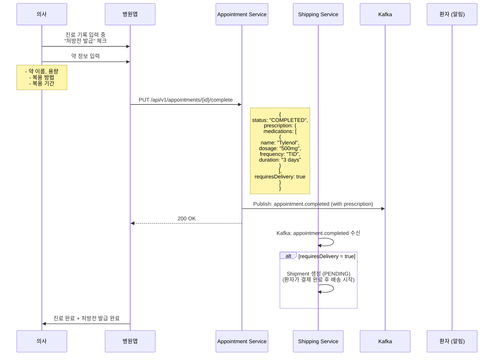

---

## 💳 8. 결제 내역 조회

### 8.1 시퀀스 다이어그램

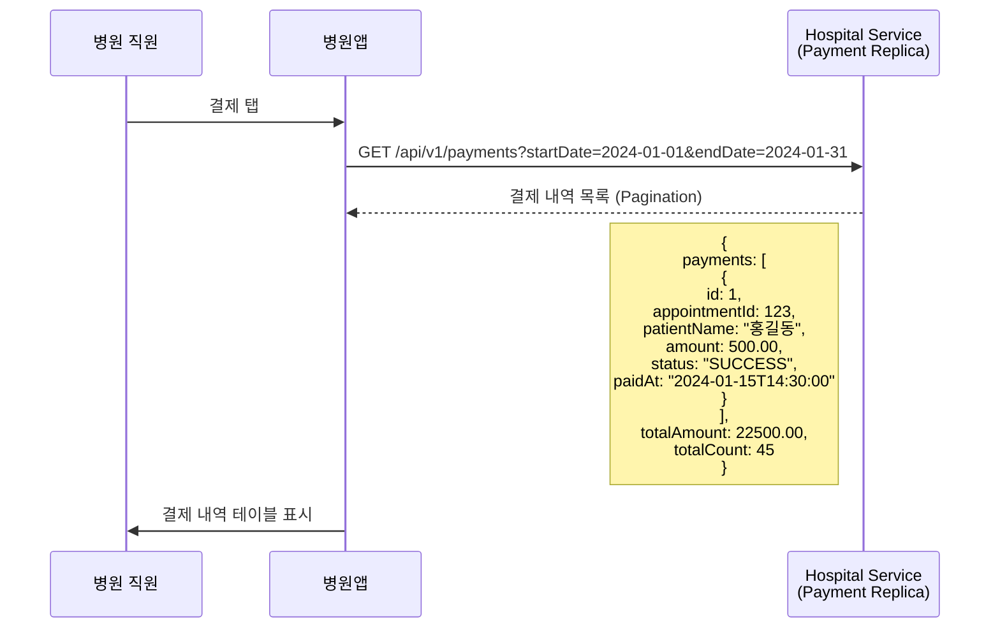

---

## 📱 9. 병원앱 전체 화면 목록

### 인증
- `/login` - 로그인

### 대시보드
- `/dashboard` - 대시보드 (통계, 최근 예약)

### 예약 관리
- `/appointment` - 예약 목록 (Waiting/Confirmed/Completed/Cancelled)
- `/appointment/:appointmentSequence` - 예약 상세 (상태별 UI 다름)
- `/appointment/:appointmentSequence/edit` - 예약 수정

### 진료
- `/consultation` - 진료 목록 (Today's Consultations)
- `/consultation/:appointmentSequence` - 진료 상세 (화상 통화)

### 환자 관리
- `/patient` - 환자 목록 (검색, Pagination)
- `/patient/new` - 환자 등록
- `/patient/:id` - 환자 상세 (기본 정보, 예약 기록, 진료 기록)

### 의사 관리
- `/doctor` - 의사 목록
- `/doctor/new` - 의사 등록
- `/doctor/:id` - 의사 상세 (기본 정보, 스케줄, 진료 통계)

### 결제
- `/payment` - 결제 내역 목록

### 병원 정보
- `/hospital` - 병원 정보 (설정, 운영 시간)

### 내 정보
- `/myinfo` - 내 정보 (프로필, 비밀번호 변경)

---

## 🔗 10. 주요 API 엔드포인트 요약

### Hospital Service (Port: 18082)

#### 인증
| Method | Endpoint | 설명 |
|--------|----------|------|
| POST | `/api/v1/auth/login` | 로그인 |
| POST | `/api/v1/auth/logout` | 로그아웃 |
| GET | `/api/v1/auth/me` | 현재 사용자 정보 |

#### 대시보드
| Method | Endpoint | 설명 |
|--------|----------|------|
| GET | `/api/v1/dashboard/stats` | 대시보드 통계 |

#### 예약 (Replica)
| Method | Endpoint | 설명 |
|--------|----------|------|
| GET | `/api/v1/appointments` | 예약 목록 (CDC Replica) |
| GET | `/api/v1/appointments/{sequence}` | 예약 상세 |
| PUT | `/api/v1/appointments/{sequence}` | 예약 수정 (의사 배정, 시간 변경) |
| PUT | `/api/v1/appointments/{sequence}/cancel` | 예약 취소 |

#### 환자 (Replica)
| Method | Endpoint | 설명 |
|--------|----------|------|
| GET | `/api/v1/patients` | 환자 목록 (CDC Replica) |
| GET | `/api/v1/patients/{id}` | 환자 상세 |
| POST | `/api/v1/patients` | 환자 등록 (Patient Service로 전달) |

#### 의사
| Method | Endpoint | 설명 |
|--------|----------|------|
| GET | `/api/v1/doctors` | 의사 목록 |
| GET | `/api/v1/doctors/{id}` | 의사 상세 |
| POST | `/api/v1/doctors` | 의사 등록 |
| PUT | `/api/v1/doctors/{id}` | 의사 정보 수정 |
| PUT | `/api/v1/doctors/{id}/schedule` | 의사 스케줄 관리 |

#### 결제 (Replica)
| Method | Endpoint | 설명 |
|--------|----------|------|
| GET | `/api/v1/payments` | 결제 내역 목록 (CDC Replica) |

---

### Appointment Service (Port: 18083)

| Method | Endpoint | 설명 |
|--------|----------|------|
| PUT | `/api/v1/appointments/{id}/complete` | 진료 완료 (진료 기록, 처방전) |
| PUT | `/api/v1/appointments/{id}/start` | 진료 시작 (상태: IN_PROGRESS) |

---

### Video Call Service (Port: 18089)

| Method | Endpoint | 설명 |
|--------|----------|------|
| POST | `/api/v1/video-calls` | 세션 생성 |
| GET | `/api/v1/video-calls/{id}` | 세션 조회 |
| GET | `/api/v1/video-calls/appointment/{id}` | 예약별 세션 조회 |
| POST | `/api/v1/video-calls/{id}/join` | 세션 참여 (의사) |
| POST | `/api/v1/video-calls/{id}/end` | 세션 종료 |

---

### Messaging Service (Port: 18084)

| Method | Endpoint | 설명 |
|--------|----------|------|
| POST | `/api/v1/chat/channels` | 채팅방 생성 (환자와 1:1) |
| GET | `/api/v1/chat/channels/{channelUrl}` | 채팅방 정보 |
| GET | `/api/v1/chat/channels/{channelUrl}/messages` | 메시지 목록 |
| POST | `/api/v1/chat/channels/{channelUrl}/messages` | 메시지 전송 |

---

## 📊 11. 병원앱 사용자 역할별 기능

### 코디네이터 (Coordinator)
- ✅ 예약 관리 (PENDING → CONFIRMED)
- ✅ 환자 등록
- ✅ 환자 조회/수정
- ✅ 의사 배정
- ✅ 환자와 채팅
- ✅ 결제 내역 조회
- ❌ 진료 수행 (의사만)
- ❌ 처방전 발급 (의사만)

### 의사 (Doctor)
- ✅ 예약 조회 (본인 예약만)
- ✅ 환자 조회
- ✅ 화상 진료 수행
- ✅ 진료 기록 작성
- ✅ 처방전 발급
- ✅ 환자와 채팅
- ❌ 예약 배정/취소 (코디네이터만)
- ❌ 환자 등록 (코디네이터만)

---

## ✅ 다음 단계
- 전체 통합 프로세스 플로우 작성
- API 누락 분석 및 개발 계획 수립
- 데이터 모델 및 타입 정의 문서 작성

