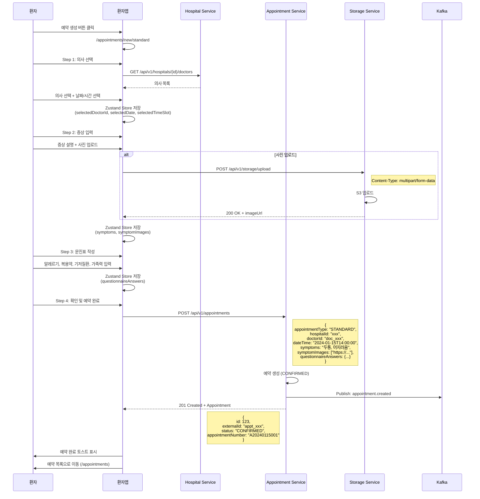
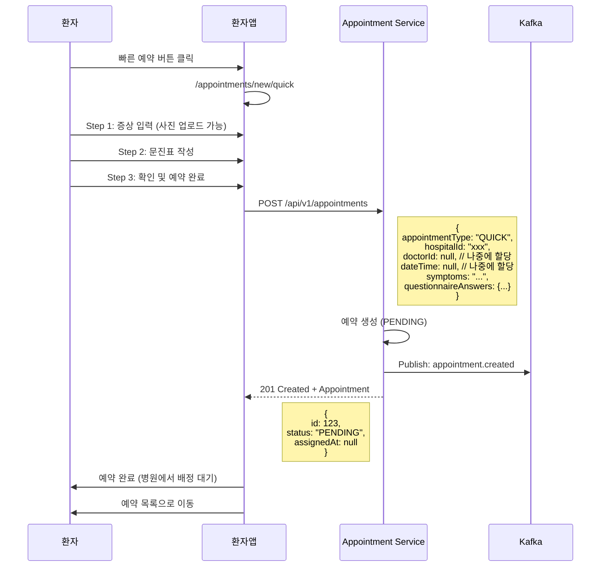
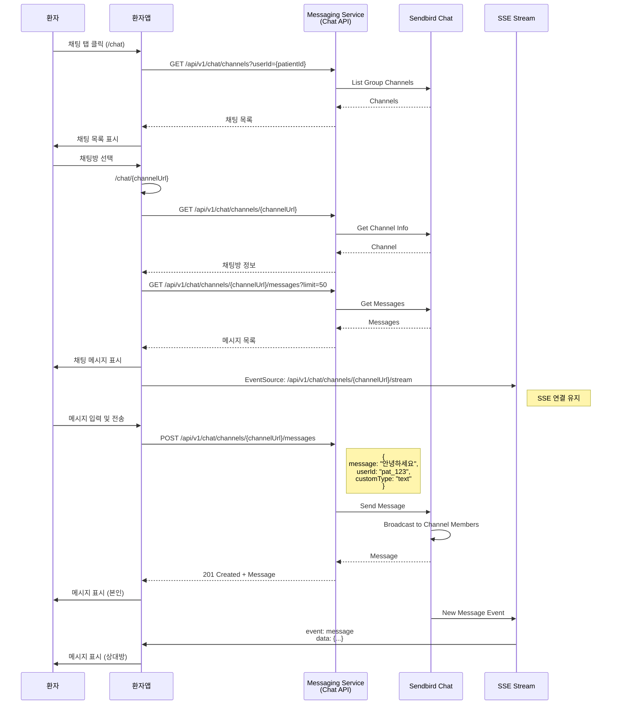
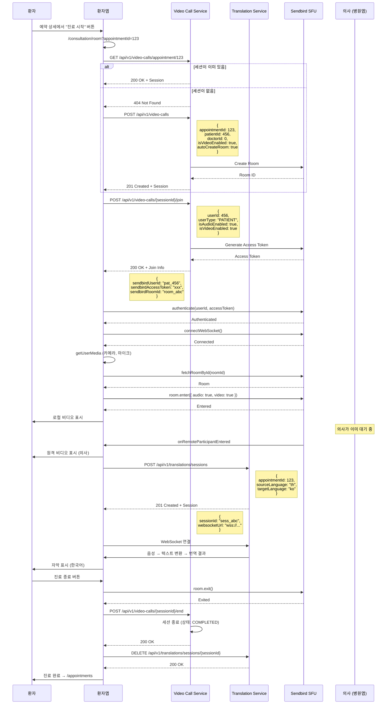
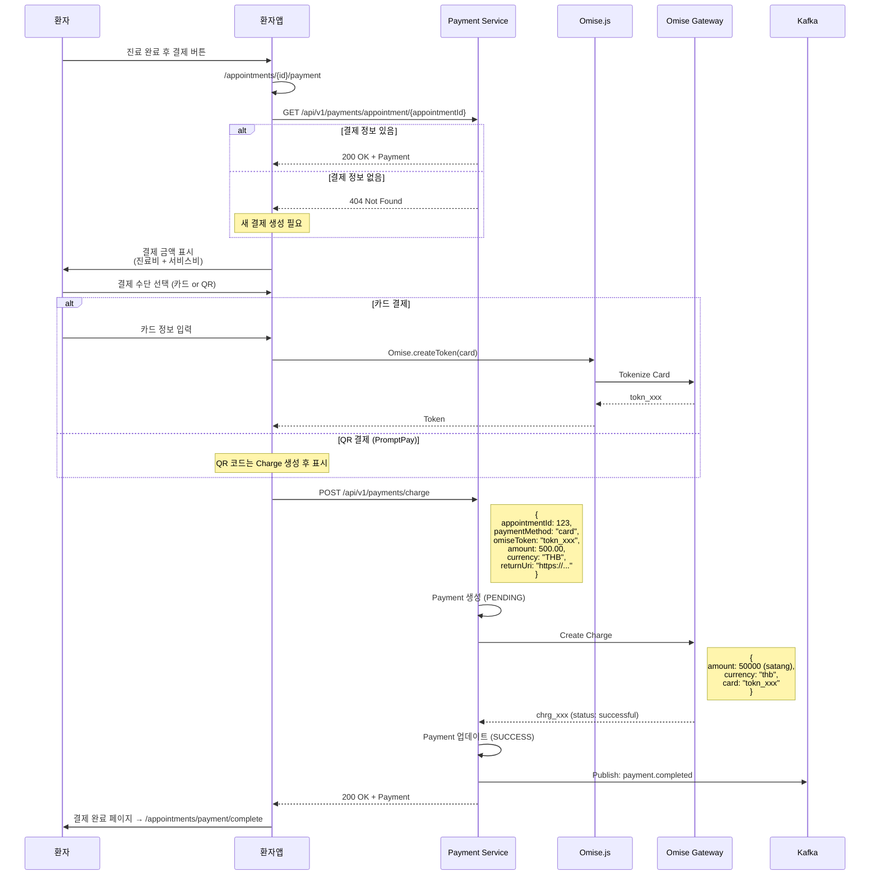
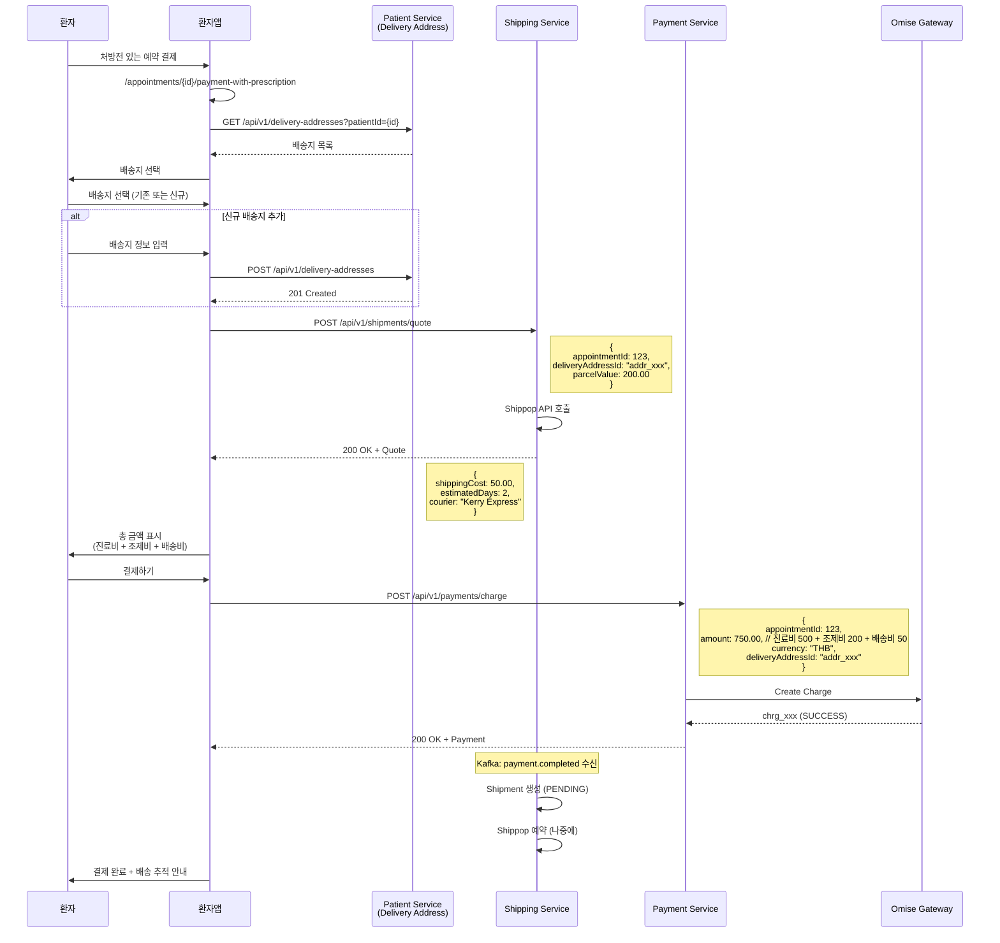
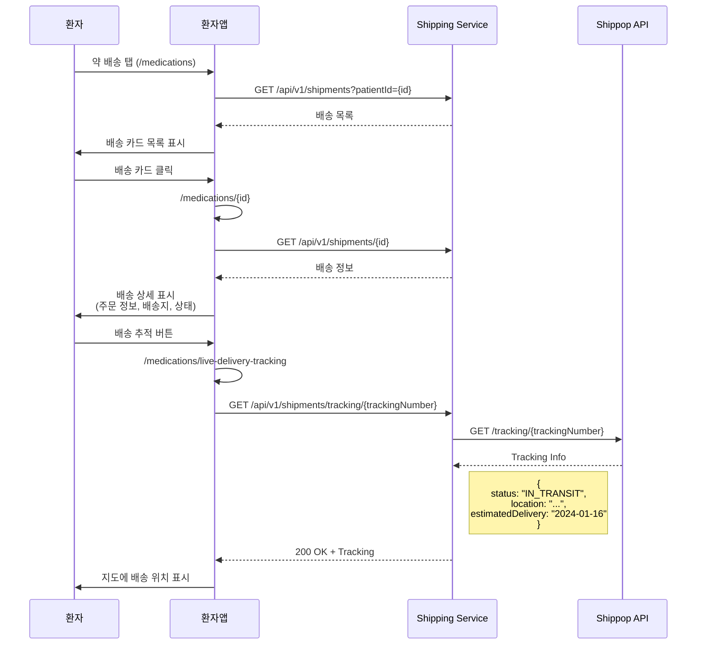
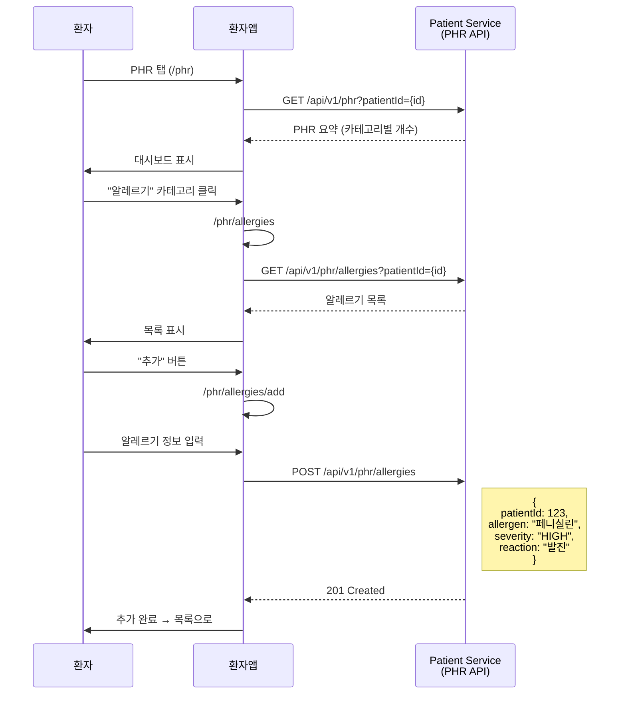

# 환자앱 (Patient App) - 유저 플로우 및 시퀀스

## 📱 환자앱 개요

환자가 비대면 진료를 받기 위한 모바일 웹 애플리케이션

**주요 기능**:
- 전화번호 기반 회원가입/로그인 (OTP 인증)
- 예약 생성 (STANDARD/QUICK)
- 화상 진료 (Sendbird Video Call)
- 실시간 채팅 (Sendbird Chat)
- 결제 (Omise)
- 약 배송 추적 (Shippop)
- 개인 건강 기록 (PHR) 관리
- 다국어 지원 (한국어, 영어, 태국어)

---

## 🔐 1. 회원가입 및 로그인 플로우

### 1.1 사용자 시나리오

#### 신규 사용자 (회원가입)
1. 전화번호 입력
2. OTP 인증 코드 수신 (SMS)
3. OTP 코드 입력 및 검증
4. 프로필 정보 입력 (이름, 성별, 생년월일 등)
5. 약관 동의
6. 회원가입 완료 → 예약 목록으로 이동

#### 기존 사용자 (로그인)
1. 전화번호 입력
2. OTP 인증 코드 수신 (SMS)
3. OTP 코드 입력 및 검증
4. 로그인 완료 → 예약 목록으로 이동

#### 병원 등록 환자 (SMS 초대)
1. 병원에서 환자 등록 (이름, 전화번호 등 입력)
2. 환자에게 SMS 발송 (가입 URL 포함)
3. URL 클릭 → 전화번호 입력
4. OTP 인증 코드 수신 (SMS)
5. OTP 코드 입력 및 검증
6. **프로필 등록 화면에 병원에서 입력한 정보가 자동으로 세팅됨**
   - 이름, 전화번호, 이메일, 생년월일, 성별, 주소, 비상연락처
   - 모든 필드 수정 가능
7. 약관 동의 및 정보 확인/수정
8. 회원가입 완료 → PENDING 예약이 있으면 자동 확정 → 예약 목록으로 이동

---

### 1.2 시퀀스 다이어그램

```mermaid
sequenceDiagram
    participant Patient as 환자
    participant PatientApp as 환자앱
    participant AuthAPI as Patient Service<br/>(Auth API)
    participant SMS as Messaging Service<br/>(SMS)

    %% Step 1: 전화번호 입력
    Patient->>PatientApp: 전화번호 입력 (+66-xxx-xxxx)
    PatientApp->>PatientApp: 전화번호 유효성 검증
    PatientApp->>AuthAPI: POST /api/auth/otp/send
    Note right of AuthAPI: {<br/>  phone: "xxx",<br/>  phoneCountryCode: "+66",<br/>  verificationType: "REGISTRATION"<br/>}
    
    AuthAPI->>SMS: OTP 발송 요청
    SMS->>Patient: SMS 전송 (OTP 코드)
    AuthAPI-->>PatientApp: 200 OK
    PatientApp->>Patient: OTP 입력 화면 표시 (3분 타이머)

    %% Step 2: OTP 검증
    Patient->>PatientApp: OTP 코드 입력 (4자리)
    PatientApp->>AuthAPI: POST /api/auth/otp/verify
    Note right of AuthAPI: {<br/>  phone: "xxx",<br/>  phoneCountryCode: "+66",<br/>  otpCode: "1234"<br/>}
    
    AuthAPI->>AuthAPI: OTP 검증
    AuthAPI-->>PatientApp: 200 OK + tempJwt
    Note left of AuthAPI: {<br/>  tempToken: "eyJhbG...",<br/>  expiresIn: 300<br/>}
    
    PatientApp->>PatientApp: tempJwt를 localStorage에 저장
    PatientApp->>AuthAPI: GET /api/auth/profile<br/>(Header: Bearer tempJwt)
    
    alt 기존 환자 (Profile 있음)
        AuthAPI-->>PatientApp: 200 OK + Profile
        PatientApp->>Patient: 로그인 완료 → /appointments
    else 신규 환자 (Profile 없음)
        AuthAPI-->>PatientApp: 404 Not Found
        PatientApp->>Patient: 프로필 등록 화면 → /auth/service-registration
        
        %% Step 3-A: 병원 등록 정보 조회 (있는 경우)
        PatientApp->>AuthAPI: GET /api/auth/profile<br/>(Header: Bearer tempJwt)
        
        alt 병원에서 등록한 환자
            AuthAPI-->>PatientApp: 200 OK + HospitalPatient Info
            Note left of AuthAPI: {<br/>  name: "홍길동",<br/>  phone: "0812345678",<br/>  email: "hong@example.com",<br/>  dateOfBirth: "1990-01-01",<br/>  gender: "MALE",<br/>  address: "123 Main St"<br/>}
            PatientApp->>PatientApp: Form 자동 세팅<br/>(모든 필드 수정 가능)
            Patient->>PatientApp: 정보 확인/수정 + 약관 동의
        else 완전 신규 환자
            AuthAPI-->>PatientApp: 404 Not Found
            Patient->>PatientApp: 프로필 정보 입력<br/>(이름, 성별, 생년월일, 약관 동의)
        end
        
        %% Step 3-B: 프로필 등록 완료
        PatientApp->>AuthAPI: POST /api/auth/profile<br/>(Header: Bearer tempJwt)
        Note right of AuthAPI: {<br/>  name: "홍길동",<br/>  gender: "MALE",<br/>  birthDate: "1990-01-01",<br/>  termsAgreed: true,<br/>  privacyAgreed: true,<br/>  dataSharingConsent: true<br/>}
        
        AuthAPI->>AuthAPI: 환자 계정 생성<br/>+ 세션 쿠키 발급 (sid)<br/>+ PENDING 예약 자동 확정
        AuthAPI-->>PatientApp: 200 OK + Cookies (sid, ctx-{subdomain})
        Note left of AuthAPI: Set-Cookie: sid=xxx; HttpOnly; Secure<br/>Set-Cookie: ctx-th=xxx; HttpOnly; Secure
        
        PatientApp->>PatientApp: tempJwt 삭제
        PatientApp->>Patient: 회원가입 완료 → /appointments
    end
```

---

### 1.3 API 명세

#### 1.3.1 OTP 발송
```
POST /api/auth/otp/send
Content-Type: application/json

Request:
{
  "phone": "0812345678",
  "phoneCountryCode": "+66",
  "verificationType": "REGISTRATION",
  "invitationToken": null
}

Response (200 OK):
{
  "success": true,
  "message": "OTP sent successfully"
}
```

#### 1.3.2 OTP 검증 및 임시 JWT 발급
```
POST /api/auth/otp/verify
Content-Type: application/json

Request:
{
  "phone": "0812345678",
  "phoneCountryCode": "+66",
  "otpCode": "1234"
}

Response (200 OK):
{
  "success": true,
  "data": {
    "tempToken": "eyJhbGciOiJIUzI1NiIsInR5cCI6IkpXVCJ9...",
    "expiresIn": 300
  }
}
```

#### 1.3.3 프로필 조회 (기존 환자 확인)
```
GET /api/auth/profile
Authorization: Bearer {tempJwt}

Response (200 OK - 기존 환자):
{
  "success": true,
  "data": {
    "id": 123,
    "name": "홍길동",
    "phone": "0812345678",
    "phoneCountryCode": "+66",
    "birthDate": "1990-01-01",
    "gender": "MALE"
  }
}

Response (404 Not Found - 신규 환자):
{
  "success": false,
  "error": {
    "code": "PROFILE_NOT_FOUND",
    "message": "Profile not found"
  }
}
```

#### 1.3.4 프로필 완성 (회원가입 완료)
```
POST /api/auth/profile/complete
Authorization: Bearer {tempJwt}
Content-Type: application/json

Request:
{
  "name": "홍길동",
  "gender": "MALE",
  "birthDate": "1990-01-01",
  "termsAgreed": true,
  "privacyAgreed": true,
  "dataSharingConsent": true
}

Response (200 OK):
{
  "success": true,
  "data": {
    "patientId": 123,
    "subscriptionId": "sub_xxx",
    "ctxToken": "ctx_token_xxx",
    "sidToken": "sid_token_xxx"
  }
}

Set-Cookie: sid=xxx; HttpOnly; Secure; Max-Age=604800; Path=/
Set-Cookie: ctx-th=xxx; HttpOnly; Secure; Max-Age=2592000; Path=/
```

---

### 1.4 인증 전략

#### 인증 토큰 종류
1. **tempJwt** (임시 JWT)
   - 용도: OTP 검증 후 ~ 프로필 완성 전
   - 저장: localStorage
   - 유효기간: 5분
   - 사용: `Authorization: Bearer {tempJwt}` 헤더

2. **sid** (세션 쿠키)
   - 용도: 로그인 완료 후 모든 API 호출
   - 저장: HttpOnly Cookie
   - 유효기간: 7일
   - 사용: 자동 전송 (withCredentials: true)

3. **ctx-{subdomain}** (컨텍스트 쿠키)
   - 용도: Sendbird 채널 컨텍스트
   - 저장: HttpOnly Cookie
   - 유효기간: 30일
   - 사용: 자동 전송

#### 인증 플로우
```
┌──────────────────┐      tempJwt       ┌──────────────────┐
│  OTP 검증 완료   │ ─────────────────> │  프로필 등록     │
│  (신규 사용자)   │   localStorage     │                  │
└──────────────────┘                    └──────────────────┘
                                                 │
                                                 │ POST /auth/profile/complete
                                                 │
                                                 ▼
┌──────────────────┐    sid + ctx 쿠키   ┌──────────────────┐
│  로그인 완료     │ <───────────────── │  회원가입 완료   │
│  (모든 API)      │   HttpOnly Cookie   │                  │
└──────────────────┘                    └──────────────────┘
```

---

## 📅 2. 예약 생성 플로우

### 2.1 예약 유형

#### STANDARD (일반 예약)
- 환자가 의사와 시간을 선택
- 즉시 예약 확정 (CONFIRMED)
- 플로우: 의사 선택 → 날짜/시간 선택 → 증상 입력 → 문진표 → 확인

#### QUICK (빠른 예약)
- 병원이 나중에 의사와 시간 할당
- 초기 상태: PENDING (대기)
- 플로우: 증상 입력 → 문진표 → 확인

---

### 2.2 시퀀스 다이어그램 - STANDARD 예약



---

### 2.3 시퀀스 다이어그램 - QUICK 예약



---

### 2.4 API 명세 - 예약 생성

```
POST /api/v1/appointments
Authorization: Cookie (sid)
Content-Type: application/json

Request (STANDARD):
{
  "appointmentType": "STANDARD",
  "hospitalId": "hosp_abc123",
  "doctorId": "doc_xyz789",
  "dateTime": "2024-01-15T14:00:00Z",
  "symptoms": "두통, 어지러움",
  "symptomImages": ["https://s3.amazonaws.com/..."],
  "questionnaireAnswers": {
    "allergies": "페니실린 알레르기",
    "currentMedications": "혈압약",
    "chronicDiseases": "고혈압",
    "familyHistory": "당뇨"
  }
}

Request (QUICK):
{
  "appointmentType": "QUICK",
  "hospitalId": "hosp_abc123",
  "doctorId": null,
  "dateTime": null,
  "symptoms": "...",
  "questionnaireAnswers": {...}
}

Response (201 Created):
{
  "success": true,
  "data": {
    "id": 123,
    "externalId": "appt_abc123",
    "appointmentNumber": "A20240115001",
    "patientId": 456,
    "hospitalId": "hosp_abc123",
    "doctorId": "doc_xyz789",
    "appointmentType": "STANDARD",
    "status": "CONFIRMED",
    "scheduledAt": "2024-01-15T14:00:00Z",
    "symptoms": "두통, 어지러움",
    "symptomImages": ["https://..."],
    "createdAt": "2024-01-10T10:00:00Z"
  }
}
```

---

## 💬 3. 채팅 플로우

### 3.1 시나리오
- 환자가 병원 코디네이터 또는 의사와 1:1 채팅
- Sendbird Chat SDK 사용
- 실시간 메시지 수신 (SSE)

### 3.2 시퀀스 다이어그램



---

## 🎥 4. 화상 진료 플로우

### 4.1 시나리오
- 예약 시간이 되면 환자가 진료실 입장
- Sendbird Video Call (SFU) 사용
- 실시간 음성 번역 (Translation Service)

### 4.2 시퀀스 다이어그램



---

## 💳 5. 결제 플로우

### 5.1 시나리오

#### Case 1: 진료비만 결제 (처방전 없음)
- 진료 완료 후 결제 페이지로 이동
- Omise.js로 결제 토큰 생성
- Payment Service에서 Charge 생성

#### Case 2: 진료비 + 약값 + 배송비 (처방전 있음)
- 진료 완료 후 처방전 발급
- 배송지 선택
- 배송비 견적 조회
- 총 금액 결제

### 5.2 시퀀스 다이어그램 - 진료비만 결제



---

### 5.3 시퀀스 다이어그램 - 약값 + 배송비 포함



---

## 📦 6. 약 배송 추적 플로우

### 6.1 시퀀스 다이어그램



---

## 🏥 7. 개인 건강 기록 (PHR) 플로우

### 7.1 시나리오
- 환자가 자신의 건강 정보를 관리
- 카테고리: 알레르기, 복용약, 진단 기록, 수술 기록, 예방접종 등

### 7.2 시퀀스 다이어그램



---

## 🌐 8. 다국어 지원

### 8.1 지원 언어
- 한국어 (ko)
- 영어 (en)
- 태국어 (th)

### 8.2 구현
- **i18n**: react-i18next
- **번역 파일**: `src/locales/{lang}/translation.json`
- **언어 변경**: Settings 페이지에서 변경
- **저장**: localStorage (`i18nextLng`)

---

## 📱 9. 환자앱 전체 화면 목록

### 인증
- `/auth/phone-verification` - 전화번호 인증
- `/auth/service-registration` - 프로필 등록

### 예약
- `/appointments` - 예약 목록 (Pending/Confirmed/Completed/Cancelled)
- `/appointments/new` - 예약 유형 선택 (STANDARD/QUICK)
- `/appointments/new/standard` - 일반 예약 (4단계)
- `/appointments/new/quick` - 빠른 예약 (3단계)
- `/appointments/:id` - 예약 상세 (상태별 UI 다름)
- `/appointments/:id/edit` - 예약 수정
- `/appointments/edit/complete` - 예약 수정 완료
- `/appointments/:id/payment` - 결제 (진료비만)
- `/appointments/:id/payment-with-prescription` - 결제 (약값 포함)
- `/appointments/payment/complete` - 결제 완료

### 약 배송
- `/medications` - 배송 목록
- `/medications/:id` - 배송 상세
- `/medications/delivery-tracking` - 배송 추적
- `/medications/live-delivery-tracking` - 실시간 배송 추적

### 진료
- `/consultation/room` - 화상 진료실

### PHR
- `/phr` - PHR 대시보드
- `/phr/:type` - 카테고리별 목록 (allergies, medications, diagnoses 등)
- `/phr/:type/add` - 새 기록 추가

### 채팅
- `/chat` - 채팅 목록
- `/chat/:channelUrl` - 채팅방

### 마이페이지
- `/mypage` - 마이페이지
- `/mypage/profile` - 프로필 수정
- `/mypage/delivery` - 배송지 관리
- `/mypage/announcements` - 공지사항 목록
- `/mypage/announcement/:id` - 공지사항 상세
- `/mypage/terms` - 약관 목록
- `/mypage/terms/:id` - 약관 상세
- `/mypage/faq` - FAQ
- `/mypage/settings` - 설정 (언어, 알림)

### 에러
- `/error/403` - 권한 없음
- `/error/404` - 페이지 없음
- `/error/500` - 서버 오류
- `/error/expired` - 세션 만료

---

## 🔗 10. 주요 API 엔드포인트 요약

### Patient Service (Port: 18081)
| Method | Endpoint | 설명 |
|--------|----------|------|
| POST | `/api/auth/otp/send` | OTP 발송 |
| POST | `/api/auth/otp/verify` | OTP 검증 + tempJwt 발급 |
| GET | `/api/auth/profile` | 프로필 조회 |
| POST | `/api/auth/profile/complete` | 프로필 완성 (회원가입) |
| GET | `/api/v1/delivery-addresses` | 배송지 목록 |
| POST | `/api/v1/delivery-addresses` | 배송지 추가 |
| GET | `/api/v1/phr` | PHR 요약 |
| GET | `/api/v1/phr/{category}` | PHR 카테고리별 목록 |
| POST | `/api/v1/phr/{category}` | PHR 추가 |

### Appointment Service (Port: 18083)
| Method | Endpoint | 설명 |
|--------|----------|------|
| POST | `/api/v1/appointments` | 예약 생성 |
| GET | `/api/v1/appointments` | 예약 목록 |
| GET | `/api/v1/appointments/{id}` | 예약 상세 |
| PUT | `/api/v1/appointments/{id}` | 예약 수정 |
| DELETE | `/api/v1/appointments/{id}` | 예약 취소 |

### Payment Service (Port: 18085)
| Method | Endpoint | 설명 |
|--------|----------|------|
| POST | `/api/v1/payments/charge` | Charge 생성 |
| GET | `/api/v1/payments/{id}` | 결제 조회 |
| GET | `/api/v1/payments/appointment/{id}` | 예약별 결제 조회 |

### Shipping Service (Port: 18090)
| Method | Endpoint | 설명 |
|--------|----------|------|
| POST | `/api/v1/shipments/quote` | 배송비 견적 |
| POST | `/api/v1/shipments` | 배송 생성 |
| GET | `/api/v1/shipments/{id}` | 배송 조회 |
| GET | `/api/v1/shipments/tracking/{trackingNumber}` | 배송 추적 |

### Messaging Service (Port: 18084)
| Method | Endpoint | 설명 |
|--------|----------|------|
| GET | `/api/v1/chat/channels` | 채팅 목록 |
| GET | `/api/v1/chat/channels/{channelUrl}` | 채팅방 정보 |
| GET | `/api/v1/chat/channels/{channelUrl}/messages` | 메시지 목록 |
| POST | `/api/v1/chat/channels/{channelUrl}/messages` | 메시지 전송 |
| GET | `/api/v1/chat/channels/{channelUrl}/stream` | SSE 스트림 |

### Video Call Service (Port: 18089)
| Method | Endpoint | 설명 |
|--------|----------|------|
| POST | `/api/v1/video-calls` | 세션 생성 |
| GET | `/api/v1/video-calls/{id}` | 세션 조회 |
| GET | `/api/v1/video-calls/appointment/{id}` | 예약별 세션 조회 |
| POST | `/api/v1/video-calls/{id}/join` | 세션 참여 |
| POST | `/api/v1/video-calls/{id}/end` | 세션 종료 |

### Translation Service (Port: 18088)
| Method | Endpoint | 설명 |
|--------|----------|------|
| POST | `/api/v1/translations/sessions` | 번역 세션 생성 |
| DELETE | `/api/v1/translations/sessions/{id}` | 번역 세션 종료 |
| WebSocket | `/api/v1/translations/sessions/{id}/stream` | 실시간 번역 |

### Storage Service (Port: 18087)
| Method | Endpoint | 설명 |
|--------|----------|------|
| POST | `/api/v1/storage/upload` | 파일 업로드 (S3) |
| GET | `/api/v1/storage/download/{key}` | 파일 다운로드 |

---

## ✅ 다음 단계
- 병원앱 플로우 문서 작성
- 전체 통합 프로세스 플로우 작성
- API 누락 분석 및 개발 계획 수립

