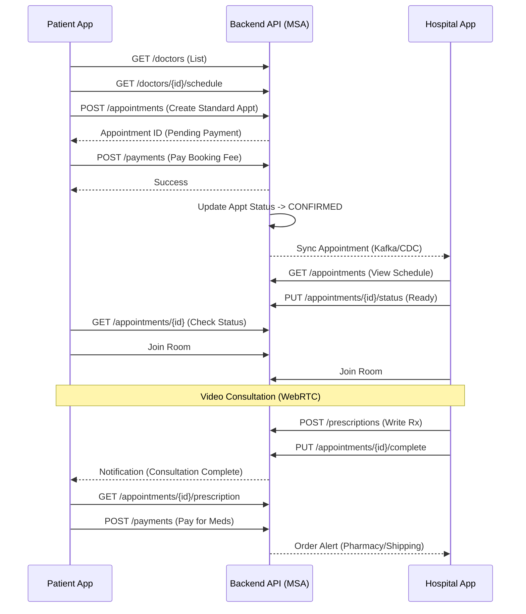

# Dr.Call Global - User Flow & API Requirement Specification

> **Version:** 1.0
> **Date:** 2025-11-19
> **Status:** Draft for Prototype Deployment
> **Note:** UI Design is the source of truth. This document derives requirements from the current Frontend implementation.

## 1. User Flows & Scenarios

### 1.1 Patient App Flow
**Primary Actor:** Patient
**Goal:** Receive telemedicine consultation and medication.

#### **Scenario: Standard Appointment Booking & Consultation**
1.  **Authentication**
    *   User opens app -> Splash.
    *   `PhoneVerification`: Enters phone number -> Receives SMS OTP -> Enters OTP.
    *   *(First Time)* `ServiceRegistration`: Enters Name, Gender, DOB, Nationality (Thai/Foreigner).
    *   **API Needed:** `POST /auth/send-otp`, `POST /auth/verify-otp`, `POST /auth/register`.

2.  **Dashboard & Doctor Selection**
    *   User sees Dashboard (Banner, Quick Menu).
    *   Selects "Book Appointment" -> "Standard Appointment".
    *   **Doctor List:** Browses doctors (filters: Specialty, Language).
    *   **Doctor Detail:** Views profile, available slots.
    *   **Selection:** Selects a specific Date & Time.
    *   **API Needed:** `GET /doctors`, `GET /doctors/{id}`, `GET /doctors/{id}/schedule`.

3.  **Pre-Consultation (Questionnaire)**
    *   User enters Symptoms (Text + Images).
    *   Fills Health Questionnaire (Height, Weight, Smoking, Alcohol, History).
    *   **API Needed:** Part of Appointment Creation payload.

4.  **Payment (Appointment)**
    *   Review Booking Details.
    *   Select Payment Method (Credit Card / PromptPay).
    *   **Action:** `createAppointment` called.
    *   **Action:** `createPayment` called.
    *   **API Needed:** `POST /appointments`, `POST /payments`.

5.  **Waiting & Consultation**
    *   Appt Status changes to `CONFIRMED`.
    *   At scheduled time: "Enter Room" button active.
    *   **Video Call:** WebRTC session (Camera/Mic).
    *   **Chat:** Can send messages/files to doctor during call.
    *   **API Needed:** `GET /consultation/token` (if external), `POST /chat/channels`, `POST /chat/messages`.

6.  **Post-Consultation (Medication)**
    *   Doctor ends call.
    *   Appt Status: `COMPLETED`.
    *   User views "Prescription" in Detail.
    *   **Medication Payment:** Selects Delivery Address -> Pays for Meds + Shipping.
    *   **API Needed:** `GET /prescriptions`, `POST /payments` (for meds), `GET /medications/delivery`.

---

### 1.2 Hospital App Flow (Admin/Doctor)
**Primary Actor:** Doctor / Coordinator (Admin)
**Goal:** Manage appointments, treat patients, manage schedule.

#### **Scenario: Doctor Consultation Process**
1.  **Login**
    *   Email/Password Login.
    *   **API Needed:** `POST /auth/login`.

2.  **Dashboard & Schedule**
    *   View "Today's Appointments".
    *   Check Status (`PENDING`, `CONFIRMED`, `WAITING`).
    *   **API Needed:** `GET /appointments?date=today`.

3.  **Consultation**
    *   Selects Appointment from list.
    *   Views Patient Info (PHR, History, Questionnaire).
    *   **Action:** Enters Video Room.
    *   **Action:** Conducts Exam.
    *   **Action:** Writes Prescription / SOAP Notes (in UI).
    *   **Action:** Ends Consultation.
    *   **API Needed:** `GET /patients/{id}`, `POST /consultations/{id}/notes`, `POST /prescriptions`.

4.  **Patient & Doctor Management (Admin)**
    *   **Patient Mgmt:** Search, View Details, Edit Info.
    *   **Doctor Mgmt:** Register new doctor, Set "Available Hours" (Weekly Schedule).
    *   **API Needed:** `GET/POST/PUT /patients`, `GET/POST/PUT /doctors`.

---

## 2. Combined Sequence Diagram (Happy Path)

---

## 3. API Requirement Specification & Gap Analysis

Based on the frontend source code (`services/*.ts`), the following APIs are required.

### 3.1 Auth Service
| Method | Endpoint | Status in Frontend | Notes |
| :--- | :--- | :--- | :--- |
| POST | `/auth/login` | ✅ Implemented | Hospital App Login |
| POST | `/auth/phone/send-otp` | ✅ Implemented | Patient App |
| POST | `/auth/phone/verify` | ✅ Implemented | Patient App |
| POST | `/auth/refresh` | ✅ Implemented | Token Refresh |
| POST | `/auth/logout` | ✅ Implemented | |

### 3.2 Appointment Service
| Method | Endpoint | Status in Frontend | Notes |
| :--- | :--- | :--- | :--- |
| GET | `/api/v1/appointments` | ✅ Implemented | List with filters (status, page) |
| GET | `/api/v1/appointments/{id}` | ✅ Implemented | Detail by ID |
| GET | `/api/v1/appointments/sequence/{seq}` | ✅ Implemented | **Hospital App Only** (Lookup by human-readable ID) |
| POST | `/api/v1/appointments` | ✅ Implemented | DTO needs `questionnaireAnswers` mapped to flat fields |
| PUT | `/api/v1/appointments/{id}` | ✅ Implemented | Update |
| DELETE | `/api/v1/appointments/{id}` | ✅ Implemented | Cancel |

### 3.3 Patient Service
| Method | Endpoint | Status in Frontend | Notes |
| :--- | :--- | :--- | :--- |
| POST | `/api/v1/patients` | ✅ Implemented | Registration |
| GET | `/api/v1/patients/{id}` | ✅ Implemented | Profile Fetch |

### 3.4 Doctor Service (Hospital App)
| Method | Endpoint | Status in Frontend | Notes |
| :--- | :--- | :--- | :--- |
| GET | `/api/v1/doctors` | ⚠️ **MOCKED** | `USE_MOCK_DATA = true` in `doctorService.ts` |
| GET | `/api/v1/doctors/{id}` | ✅ Implemented | |
| POST | `/api/v1/doctors` | ✅ Implemented | Register Doctor |
| PATCH | `/api/v1/doctors/{id}` | ✅ Implemented | Update Info |
| PATCH | `/api/v1/doctors/{id}/status` | ✅ Implemented | Toggle Active/Inactive |

### 3.5 Payment Service
| Method | Endpoint | Status in Frontend | Notes |
| :--- | :--- | :--- | :--- |
| POST | `/api/v1/payments` | ✅ Implemented | Supports `Omise` token/source |
| GET | `/api/v1/payments/{id}` | ✅ Implemented | |
| POST | `/api/v1/payments/{id}/refund` | ✅ Implemented | |

### 3.6 Chat Service
| Method | Endpoint | Status in Frontend | Notes |
| :--- | :--- | :--- | :--- |
| POST | `/api/v1/chat/channels` | ✅ Implemented | Create 1:1 Channel |
| GET | `/api/v1/chat/users/{id}/channels` | ✅ Implemented | List Channels |
| POST | `/api/v1/chat/channels/{url}/messages`| ✅ Implemented | Send Message |
| GET | `/api/v1/chat/channels/{url}/messages`| ✅ Implemented | History |
| PUT | `/api/v1/chat/channels/{url}/close` | ✅ Implemented | End Chat |

---

## 4. Immediate Action Items (For Tomorrow's Prototype)

1.  **Un-Mock Doctor Service:**
    *   The `apps/hospital-app/src/services/doctorService.ts` has `USE_MOCK_DATA = true`. This must be set to `false` and the backend must implement `GET /api/v1/doctors` with search/filtering.
2.  **Kafka/CDC Sync Verification:**
    *   The Hospital App relies on `appointmentSequence` (External ID). Ensure the backend correctly generates this readable ID and syncs it if using microservices.
3.  **Payment Gateway:**
    *   Ensure `Omise` keys are configured in the Frontend `.env` (not committed).
4.  **Video Call Provider:**
    *   `videoCallService.ts` needs to be checked to ensure it points to a valid provider (e.g., LiveKit, Agora) or internal Signaling Server.

